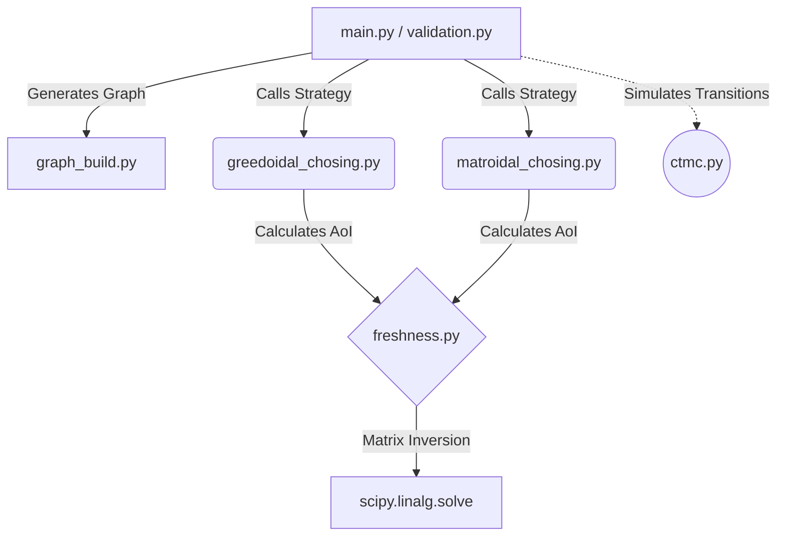

<div align="center">
  <h1>🚀 Comms Simulation: Age of Information (AoI) 🚀</h1>
  <p><i>A wicked-fast, graph-theoretic Continuous-Time Markov Chain (CTMC) & network freshness simulator!</i></p>
</div>

---

## ⚡ What is this project?

This project simulates dynamic communication networks by modeling the **Age of Information (AoI)** – also known as **"Freshness"**. When trying to figure out which links (edges) inside a chaotic network topology are doing the heavy-lifting, selecting the most optimal paths is NP-Hard.

To tackle this, we implement and compare two distinct edge-selection philosophies over a directed network graph:
1. **The Greedoidal Approach:** Only evaluates links connected to the current "known" frontier. Safely connected, but potentially near-sighted.
2. **The Matroidal Approach:** A pure greedy strategy evaluating the entire network uniformly. It can pick disconnected links predicting they will connect later, finding unique global optimas!

> [!TIP]
> **Age of Information (AoI)** captures the timeliness of information at a destination. Unlike raw latency, AoI focuses on *how fresh* the data is when it actually arrives!

---

## 🏗️ Architecture & Modules

This repository is powered by interconnected mathematical engines solving **Stochastic Hybrid Systems (SHS)** via linear algebra.



### 📂 The Core Files:

* `graph_build.py`: Constructs complex directed network graphs with diverse path rates, extreme bottlenecks, and tricky cross-connections.
* `freshness.py`: The physics engine! Calculates the "Universal Freshness" of a sub-graph using system equations (`solve_shs`). 
* `ctmc.py`: Continuous-Time Markov Chain simulator modeling state transitions over randomized time steps (`random.expovariate`).
* `greedoidal_chosing.py`: The Greedoid selection logic. Builds the graph path-by-path from the source.
* `matroidal_chosing.py`: The Matroid selection logic. Grabs the most statically valuable edges anywhere in the network.
* `main.py`: The primary visual playground. Builds the master graph, runs both algorithms, and visualizes the sub-graph networks side-by-side using `matplotlib`.
* `validation.py`: The heavy-duty benchmarking script! Runs rigorous Monte Carlo simulations scaling over many random $G(n,p)$ graphs to empirically compare Matroidal vs Greedoidal freshness scores.

---

## 🚀 How to Run the Code

Start by firing up your terminal. Make sure you have the dependencies installed (`networkx`, `numpy`, `scipy`, `matplotlib`, `seaborn`).

### 1. The Playground (Visualization)
To see the network layout and visual representation of Matroidal vs Greedoidal choices, run:
```bash
python main.py
```
> [!NOTE]
> `main.py` uses the massive 25-node ultra-complex graph defined in `graph_build.py`. You'll see a side-by-side subplot of the sub-topologies chosen by both algorithms.

### 2. The Benchmark (Validation)
Want to empirically see which strategy wins out in the wild? Run the large scale testing suite:
```bash
python validation.py
```
> [!WARNING]
> Validation generates large `nx.fast_gnp_random_graph` instances. It might take a few seconds as it solves inverses for large matrices iteratively! You'll get a beautiful scatter plot and histogram showing the distribution gap between both algorithms.

---

## 🧠 Why is this so cool?
Selecting $K$ edges out of a network to maximize overall node freshness is notoriously difficult. By comparing a constrained frontier search (Greedoid) against an unconstrained search (Matroid), we gain insights into *where* data decays the fastest over unreliable channels! 

Happy Simulating! 📉📡
